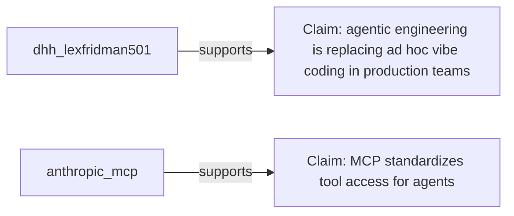
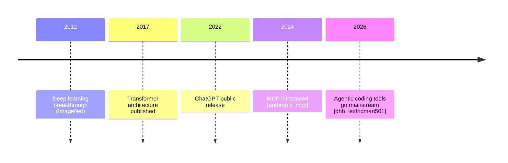

# Presentation Prep Report Template

Used to structure `report/draft.md` and `report/final.md`. Adapted from
`demos/weather/references/report-template.md` — organized by talk section
(since the output feeds slide-writing) rather than by research theme.

---

## Report structure

```markdown
# AI/AGI Overview — Presentation Synthesis Report

**Prepared:** <date>
**Sources:** N (N primary, N supporting)
**Audience:** Software engineers + tech-savvy business people
**Length:** ~20–30 min lightning talk
**Stated goal:** attendees leave able to be conversational about AI

---

## Executive Summary
<3–5 sentences: the core narrative arc of the talk, the single most
important idea, and the biggest open gap or risk in the current draft>

---

## Vocabulary List
<Every technical term the talk uses, one-line definition each, source-checked>

| Term | One-line definition | Source |
|---|---|---|
| Model | … | … |
| Inference | … | … |
| Harness | … | … |
| MCP | … | … |
| Open-weight | … | … |
| Benchmark | … | … |
| AGI | … | … |

---

## Evidence Landscape

### Areas of agreement (2+ independent sources)
<Claims supported across sources, inline citations [source_short_name]>

### Contradictions / contested claims
<Where sources disagree — e.g., AGI timelines, hype-cycle placement — cite
both/all sides, do not resolve artificially>

### Gaps
<Questions the current source set doesn't answer — candidates for the
loopback to source-gathering>

---

## Section-by-Section Content Brief

For each of the 10 talk sections, following `demos/ai-overview/sources/`
and the confirmed outline:

### 1. Cold open
**Core claim(s):** …
**Supporting citations:** …
**Visual idea:** … (per STYLE_GUIDE.md — every section needs one)

### 2. Fast history
…

### 3. Gartner Hype Cycle
…

### 4. What's a neural network
…

### 5. Model vs. inference vs. harness (+ MCP)
…

### 6. Model landscape: open-weight vs. closed
…

### 7. Benchmarks
…

### 8. AGI: what the term means
…

### 9. Responsible AI: governance, cost, people, planet
**Sub-angles:** governance/regulation, cost & efficiency, social
responsibility, environmental impact — see `sources/triage-report.md` #7, 9b, 9c
…

### 10. Business lens
…

### 11. Close
…

---

## Evidence Map



---

## History Timeline



---

## Conclusions
<What the evidence supports putting on stage with confidence, and what
should stay clearly framed as opinion/contested>

---

## Recommended Next Steps
<Any gaps worth a loopback to add more sources before finalizing>

---

## Bibliography
<Full citations: source short-name, title, author/publisher, date, direct
URL — sorted in talk-section order, not alphabetical, since this feeds
slide-writing>
```
