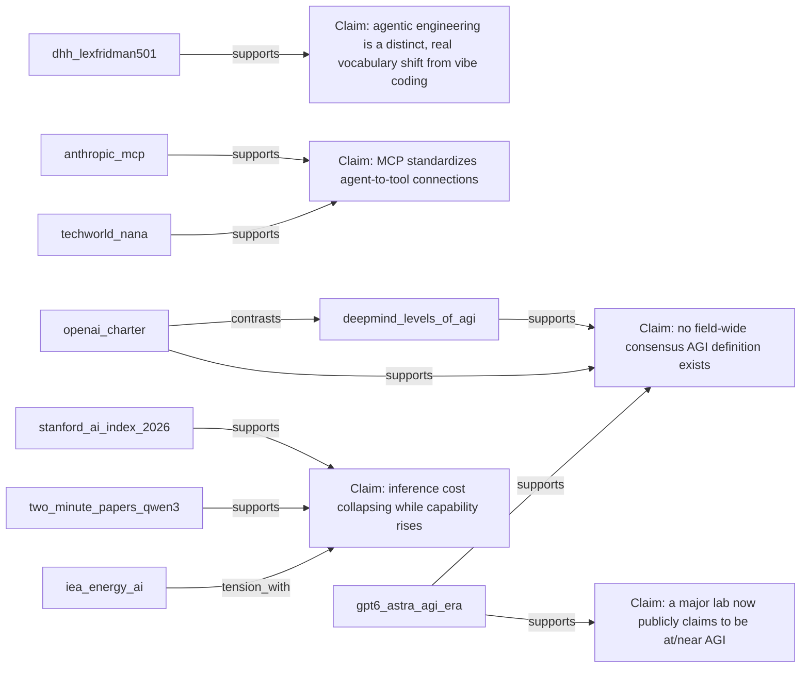
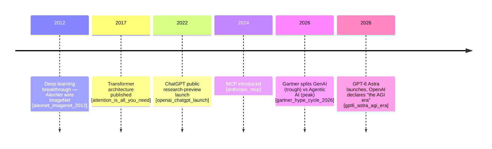

# AI/AGI Overview — Presentation Synthesis Report

**Prepared:** 2026-09-04
**Sources:** 20 (17 primary, 3 supporting — per the numeric 40/30/30 rescore in sources/triage-report.md)
**Audience:** Software engineers + tech-savvy business people
**Length:** ~25–28 min lightning talk
**Stated goal:** attendees leave able to be conversational about AI

---

## Executive Summary

The core narrative: AI capability is accelerating on every measurable axis
(benchmarks, task-autonomy, adoption, investment) while getting
dramatically cheaper per unit of use — and the hardest part of "keeping
up" isn't the model layer, it's the fast-moving harness/tooling layer
around it (agents, MCP, coding tools) plus the governance/cost/
environmental questions that now come attached to it. The single strongest
anchor is `gpt6_astra_agi_era` — OpenAI declared "the AGI era" three days
before this talk's own research pass, giving the whole talk a live,
concrete "this is happening right now" spine instead of an abstract one.
Biggest open risk: several of the most current numbers (GPT-6 Astra
benchmarks, METR's latest time horizon) are genuinely still moving —
flag verbally on stage that some figures may already be stale by
delivery day.

---

## Vocabulary List

| Term | One-line definition | Source |
|---|---|---|
| Model | The trained weights — the "brain" — with no surrounding product wrapper | general |
| Inference | Running a trained model to produce an output; the compute/serving step | general |
| Harness | The software wrapped around a model that makes it usable — chat UI, memory, tool access, agent loop | [dhh_lexfridman501] |
| MCP (Model Context Protocol) | Open standard letting a model/agent call external tools and data through one protocol instead of bespoke integrations | [anthropic_mcp] |
| Open-weight | A model whose trained weights are downloadable/runnable by anyone — not the same as open-source (training data/code are often still closed) | [two_minute_papers_qwen3] |
| Benchmark | A standardized test used to compare model capability — static (MMLU, SWE-bench), human-preference (LMArena), or task-autonomy (METR time horizon) | [lmarena_chatbot_arena], [metr_long_tasks] |
| AGI | "Artificial General Intelligence" — a contested term with no field-wide agreed definition; see Section 8 | [openai_charter], [deepmind_levels_of_agi] |
| Hype Cycle | Gartner's model for how expectations about a technology rise, crash, and recover over time | [gartner_hype_cycle_2026] |
| Time horizon | METR's metric: the length of task (in human-expert time) a model can complete autonomously at 50% success | [metr_long_tasks] |
| GPAI | "General-Purpose AI" — the EU AI Act's regulatory category for foundation models | [eu_ai_act_2024_1689] |
| Mixture of Experts (MoE) | An architecture that routes each input to a small subset of specialized "expert" sub-networks instead of activating the whole model — lets parameter count scale into the trillions without a proportional rise in per-query compute | [mixtral_of_experts] |

---

## Evidence Landscape

### Areas of agreement (2+ independent sources)
- AI capability is accelerating, not plateauing — [stanford_ai_index_2026], [metr_long_tasks], [two_minute_papers_qwen3]
- The harness/agent-tooling layer is the current center of gravity, not raw model capability alone — [dhh_lexfridman501], [anthropic_mcp], [techworld_nana]
- Cost/efficiency per unit of capability is falling fast — [stanford_ai_index_2026], [two_minute_papers_qwen3]

### Contradictions / contested claims
- Efficiency improving *and* aggregate energy footprint growing fast — both true at once ([stanford_ai_index_2026] + [two_minute_papers_qwen3] vs. [iea_energy_ai]) — present as nuance, not resolve
- "Is GPT-6 Astra AGI?" — Brockman himself hedges even while declaring it ([gpt6_astra_agi_era]) — present as a live, attributed, unresolved claim
- How bold to be on "manual programming's future" — DHH's provocative framing ([dhh_lexfridman501]) vs. Woods's softer augmentation framing ([ai_driven_leader_woods])

### Gaps
All three original gaps (Gartner, AGI definitions, pre-2024 history) closed
via the Gate 2a loopback — see `report/analysis.md`. Remaining minor items:
`techworld_nana` has no specific citable video (channel-level framing
only), and several 2026-dated figures (GPT-6 Astra benchmarks, METR's
latest time horizon) should be re-checked close to the actual talk date
since they're moving targets.

---

## Section-by-Section Content Brief

### 1. Cold open (~2 min)
**Core claim(s):** Three days before this talk was researched, OpenAI
released GPT-6 Astra and its president said "Welcome to the AGI era."
Whatever you think of that claim, it's a fact that a major lab is now
saying this out loud, not just researchers in a lab. Pair with adoption
speed: generative AI hit 53% population adoption in three years — faster
than the PC or the internet.
**Supporting citations:** [gpt6_astra_agi_era], [stanford_ai_index_2026]
**Visual idea:** Full-bleed screenshot of the actual OpenAI announcement
page/headline, or a simple adoption-speed chart (PC vs. internet vs.
gen-AI adoption curves).

### 2. Fast history (~3 min)
**Core claim(s):** 2012 — deep learning breaks through (AlexNet beats the
next-best ImageNet entry by 10.8 points). 2017 — the Transformer
architecture is published, becomes the foundation of every major LLM
since. Nov 2022 — ChatGPT launches as an understated "research preview"
and hits 1M users in five days. Sept 2026 — GPT-6 Astra and "the AGI era."
**Supporting citations:** [alexnet_imagenet_2012], [attention_is_all_you_need], [openai_chatgpt_launch], [gpt6_astra_agi_era]
**Visual idea:** Mermaid timeline (see below) as an actual on-slide visual,
not a bulleted list.

### 3. Gartner Hype Cycle (~2 min)
**Core claim(s):** Explain the curve (Innovation Trigger → Peak of
Inflated Expectations → Trough of Disillusionment → Slope of Enlightenment
→ Plateau of Productivity). Concrete 2026 placement: generative AI now
sits in the Trough of Disillusionment; agentic AI sits at the Peak of
Inflated Expectations, heading toward its own trough — two different
technologies, two different points on the curve, right now. Honest
caveat: Gartner's own hype cycle has fragmented into 7+ separate AI
sub-cycles in 2026 — even Gartner isn't tracking "AI" as one thing anymore.
**Supporting citations:** [gartner_hype_cycle_2026]
**Visual idea:** The actual hype-cycle curve shape, with two labeled dots
(GenAI, Agentic AI) placed at their respective 2026 points — a real
diagram, not a photo of a Gartner slide.

### 4. What's a neural network (~3 min)
**Core claim(s):** Plain-language mental model: a function trained on
many examples to approximate a pattern, made of weighted connections
adjusted through training — no calculus needed for the room to follow.
**Supporting citations:** none required (pedagogical explainer, not a
contested factual claim per `analysis.md`)
**Visual idea:** A simple animated/static diagram of inputs → weighted
connections → output, not a stock "glowing brain" image.

### 5. Model vs. inference vs. harness (+ MCP) (~4 min)
**Core claim(s):** Model = weights. Inference = running it. Harness =
everything wrapped around it (Claude Code, Cursor, ChatGPT the product).
MCP is the concrete example of what a harness actually does under the
hood: an open standard (launched Nov 25, 2024, MIT-licensed) so an agent
can call external tools/data through one protocol instead of bespoke
integrations per tool — adopted early by Block, Apollo, Zed, Replit,
Codeium, Sourcegraph. DHH's vocabulary distinction — "vibe coding"
(loose prompting, light review) vs. "agentic engineering" (structured
agent loops with tests/review/tool access) — is a live, real distinction
engineers are actively having this conversation about right now. Nana's
DevOps-native audience is the proof this is landing in real infra, not
just chat UIs.
**Supporting citations:** [anthropic_mcp], [dhh_lexfridman501], [techworld_nana]
**Visual idea:** A layered diagram — model at the bottom, inference in the
middle, harness on top, with MCP drawn as the connector reaching out to
external tools/data. This is the talk's most important diagram.

### 6. Model landscape: open-weight vs. closed (~4 min)
**Core claim(s):** Closed: Anthropic (Claude), OpenAI (GPT), Google
DeepMind (Gemini). Open-weight: Meta (Llama), Mistral, Alibaba (Qwen),
DeepSeek. Open-weight ≠ open-source — weights are downloadable, but
training data/code are usually still closed. Proof point: Qwen3.8-27B is
a comparatively small, dense, open-weight model punching well above its
size class, efficient enough for local/on-device deployment.

**New sub-topic — Mixture of Experts (MoE):** how do the biggest models
stay efficient at trillion-parameter scale? MoE routes each input token
to a small subset of specialized "expert" sub-networks via a router,
instead of activating every parameter on every query — total parameters
can be huge, active compute per token stays much smaller. GPT-6 Astra is
rumored (unconfirmed by OpenAI — industry reporting only) to use a ~10
trillion-parameter MoE architecture — a clean teaching moment about the
gap between leaked specs and confirmed ones. Two concrete, fully-open
counter-examples: Mixtral (Mistral's published, open-weight MoE model —
architecture entirely public, unlike Astra's) and DeepSeek-V4-Flash
(284B total parameters, only 13B activated per token — a clean, exact,
publisher-confirmed ratio to put right next to Astra's fuzzy "~10T,
unconfirmed" rumor). DeepSeek also claims its 13B-active Flash beats its
own larger 49B-active model on every agentic benchmark it publishes, at a
fraction of the cost — self-reported, but a strong "smaller can beat
bigger" illustration either way. (Note: Qwen3.8-27B, above, is dense, not
MoE — the true MoE Qwen variant is Qwen3-30B-A3B, 128 routed experts with
top-8 activation, not previously in this source set.)

**Supporting citations:** [two_minute_papers_qwen3], [mixtral_of_experts], [deepseek_v4_flash], [gpt6_astra_agi_era]
**Visual idea:** A simple two-column logo/name grid (closed vs.
open-weight) with a callout box defining "open-weight ≠ open-source,"
plus a second diagram: dense model (all neurons lit up) vs. MoE model
(router lighting up only a few expert blocks) — a visual, not a bullet
list, for the MoE mechanism itself.

### 7. Benchmarks (~3 min)
**Core claim(s):** Three different kinds of benchmark, each measuring
something different: static test-set (MMLU, SWE-bench — Verified rose
from ~60% to ~100% in a single year per Stanford's Index), human
preference (LMArena, formerly LMSYS Chatbot Arena — even the arena's own
name changed), and task-autonomy (METR's time horizon, doubling roughly
every 7 months, ~110 min at March 2025 — check the Jan 2026 update for a
fresher number). Why leaderboards can mislead: GPT-6 Astra's headline
ARC-AGI-3 score used OpenAI's own API/scaffold, and a reported
NVIDIA-built system scored just as high on the same eval using Claude
Opus 5 with a much lower baseline model — the surrounding system, not
just the base model, drives the number.
**Supporting citations:** [stanford_ai_index_2026], [lmarena_chatbot_arena], [metr_long_tasks], [gpt6_astra_agi_era]
**Visual idea:** A real screenshot of a leaderboard (LMArena or
SWE-bench), annotated to show what's actually being measured — not a
generic bar chart.

### 8. AGI: what the term means (~2 min)
**Core claim(s):** No field-wide agreed definition. OpenAI's charter:
"highly autonomous systems that outperform humans at most economically
valuable work." DeepMind's alternative: a 5-level framework (Emerging →
Competent → Expert → Virtuoso → Superhuman) separating performance from
generality, explicitly built because a single yes/no label creates
unproductive debate. Live example: OpenAI's own president, announcing
GPT-6 Astra three days before this talk's research pass, said "Welcome to
the AGI era" — then immediately hedged: "Everyone has a different
definition of AGI... it's a much more gray, fuzzy thing." Present the
landscape, not a prediction.
**Supporting citations:** [openai_charter], [deepmind_levels_of_agi], [gpt6_astra_agi_era]
**Visual idea:** Side-by-side quote cards — OpenAI's one-line definition
vs. DeepMind's 5-level ladder vs. Brockman's own hedge — showing three
serious, disagreeing framings at once.

### 9. Responsible AI: governance, cost, people, planet (~3–4 min)
**Core claim(s):**
- *Governance:* Two parallel mechanisms — self-governance (Anthropic's
  RSP, v3.4, gates releases by AI Safety Level thresholds; OpenAI's own
  Preparedness Framework similarly gated GPT-6 Astra's cybersecurity
  capability) and external regulation (EU AI Act — risk-tiered, GPAI/
  transparency duties already in force since Aug 2026, high-risk rules
  delayed to 2027/2028, fines up to €35M or 7% global turnover).
- *Cost/efficiency:* Inference cost for GPT-3.5-level performance dropped
  ~280x in two years ($20 → $0.07 per million tokens).
- *Environmental:* AI-focused data center electricity demand grew 50% in
  2025 (vs. 3% overall grid growth); could hit ~945 TWh by 2030 (more
  than Japan's current total use) — but data centers overall are still
  only ~1% of global electricity and 0.5% of CO2 today. State both
  numbers together.
- *Social:* Point to Stanford's Index responsible-AI chapter (incident
  tracking, public opinion) as the place this gets tracked systematically.
**Supporting citations:** [anthropic_rsp], [gpt6_astra_agi_era], [eu_ai_act_2024_1689], [stanford_ai_index_2026], [iea_energy_ai]
**Visual idea:** A four-quadrant visual (governance / cost / social /
environmental), each quadrant with one real number, not four separate
bullet-only slides.

### 10. Business lens — AI-Driven Leader tie-in (~2 min)
**Core claim(s):** Woods's reframe: AI as a strategic thinking partner,
not a faster assistant. His CRIT framework (Context, Role, Interview,
Task) as a concrete prompting structure the business-facing half of the
room can use tomorrow. His claim that AI creates value in exactly three
ways — more productive people, more efficient operations, more valuable
products/services — as a simple mental model to bridge back to the
technical sections.
**Supporting citations:** [ai_driven_leader_woods]
**Visual idea:** The CRIT framework as a simple 4-box visual, not a
paragraph.

### 11. Close (~2 min)
**Core claim(s):** How to stay conversational: follow release notes/
system cards directly from the labs (not just press coverage), pick one
benchmark leaderboard and actually understand what it measures, go touch
a harness yourself (an MCP-enabled tool, an agentic coding session) rather
than only reading about it.
**Supporting citations:** none needed — this is a call to action, not a claim
**Visual idea:** A short, concrete "do this by Friday" checklist slide.

---

## Evidence Map

---

## History Timeline

---

## Conclusions

Confident to state as fact on stage: the acceleration/cost-collapse
narrative (multi-source), the model/inference/harness/MCP framework
(primary-sourced), the Gartner 2026 dual-placement, and the pre-2024
history beats (all uncontested primary sources). Keep clearly attributed
as opinion, not fact: DHH's "manual programming's future" framing,
Woods's leadership framework claims, and Brockman's "AGI era" declaration
itself — state that OpenAI said it, not that it's settled.

## Recommended Next Steps

- Verify GPT-6 Astra's exact benchmark numbers against its official system
  card before finalizing slide copy (OpenAI's own page and press coverage
  disagree slightly)
- Pull METR's Jan 2026 "Time Horizon 1.1" update for a fresher number than
  the March 2025 ~110-minute figure
- If time allows, identify one specific TechWorld with Nana video (rather
  than channel-level framing) for a more citable Section 5 claim

## Bibliography

1. DHH — Lex Fridman Podcast #501 (Aug 26, 2026). https://lexfridman.com/dhh-2/
2. Two Minute Papers — "This Small AI Will Change Everything" (Aug 2026). https://www.youtube.com/watch?v=wMl6c_r0ubw
3. Geoff Woods — *The AI-Driven Leader*. https://www.amazon.com/AI-Driven-Leader-Harnessing-Smarter-Decisions/dp/B0DB8QL3ZK
4. TechWorld with Nana. https://www.youtube.com/@TechWorldwithNana
5. Anthropic — "Introducing the Model Context Protocol" (Nov 25, 2024). https://www.anthropic.com/news/model-context-protocol
6. Alex Krizhevsky, Ilya Sutskever, Geoffrey Hinton — "ImageNet Classification with Deep Convolutional Neural Networks" (NIPS 2012). https://papers.nips.cc/paper/4824-imagenet-classification-with-deep-convolutional-neural-networks
7. Vaswani et al. — "Attention Is All You Need" (2017). https://arxiv.org/abs/1706.03762
8. OpenAI — "Introducing ChatGPT" (Nov 30, 2022). https://openai.com/index/chatgpt/
9. Gartner — "2026 Hype Cycle for Agentic AI." https://www.gartner.com/en/articles/hype-cycle-for-agentic-ai
10. OpenAI Charter. https://openai.com/charter/
11. Google DeepMind — "Levels of AGI" (2023). https://arxiv.org/abs/2311.02462
12. OpenAI — "GPT-6 Astra: A new generation of intelligence" (Sept 3, 2026). https://openai.com/index/gpt-6-astra/
13. LMArena (formerly LMSYS Chatbot Arena). https://lmarena.ai
14. METR — "Measuring AI Ability to Complete Long Software Tasks" (Mar 19, 2025). https://metr.org/blog/2025-03-19-measuring-ai-ability-to-complete-long-tasks/
15. Stanford HAI — "The 2026 AI Index Report" (Apr 2026). https://hai.stanford.edu/ai-index/2026-ai-index-report
16. Anthropic — "Responsible Scaling Policy" (v3.4, Jul 8, 2026). https://www.anthropic.com/responsible-scaling-policy
17. International Energy Agency — "Energy and AI" (2026). https://www.iea.org/reports/energy-and-ai
18. European Union — Regulation (EU) 2024/1689 (EU AI Act), consolidated 2026-07-27. https://eur-lex.europa.eu/eli/reg/2024/1689/2026-07-27/eng
19. Mistral AI — "Mixtral of Experts" (Jan 2024). https://arxiv.org/pdf/2401.04088
20. DeepSeek — "DeepSeek-V4-Flash-0731" (Jul 31, 2026). https://huggingface.co/blog/ResterChed/deepseek-v4-flash-official-release
