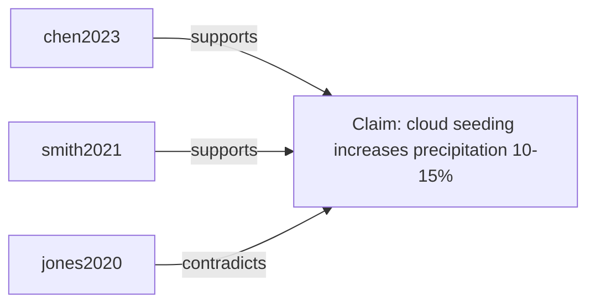
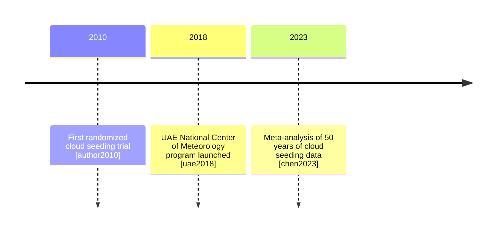

# Research Report Template

Used by the `synthesize-report` skill to structure the final output.

---

## Report structure

```markdown
# <Topic> — Research Synthesis Report

**Prepared:** <date>
**Sources:** N papers (N primary, N supporting)
**Research question:** <question>

---

## Executive Summary
<3–5 sentences: key finding, strongest consensus, most important gap>

---

## Introduction
<Background on the topic; why this research question matters>

---

## Evidence Landscape

### Areas of Consensus
<Claims supported by 3+ papers, with inline citations [chen2023]>

### Contradictions
<Conflicting findings between papers, with both sides cited>

### Gaps
<Questions the literature does not yet answer>

---

## Methodology Comparison
<Table or narrative comparing study designs across papers>

---

## Key Findings by Theme

### Theme 1: <name>
…

### Theme 2: <name>
…

---

## Evidence Map



---

## Methodology Timeline



---

## Conclusions
<Synthesis of what the evidence supports, with confidence levels>

---

## Recommended Next Steps
<Gaps that warrant further literature review or loopback to discover-sources>

---

## Bibliography
<Full citations in Chicago author-date format, DOI links, sorted alphabetically>
```
