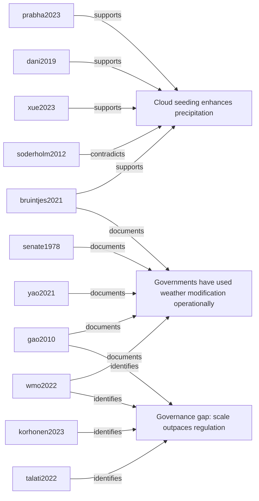
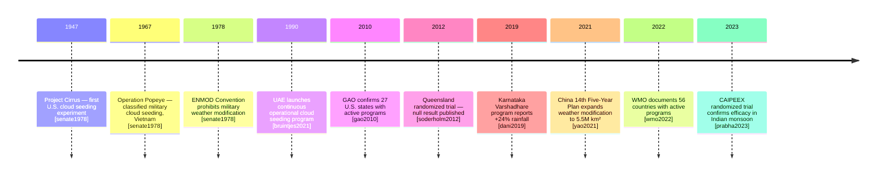

# Global Weather Modification Programs: A Research Synthesis

**Prepared:** 2026-05-22
**Sources:** 12 papers (7 primary, 5 supporting)
**Research question:** What are global weather modification programs and their documented effects?

---

## Executive Summary

Weather modification — primarily cloud seeding — is practiced by over 56 countries and is a fully operational, government-funded technology, not a fringe concept [wmo2022]. Programs range from the UAE's 30-year cloud seeding operation [bruintjes2021] and China's program employing 50,000 rocket launchers [yao2021] to the U.S. government's own documented history including the classified military program Operation Popeye [senate1978]. Scientific evidence supports precipitation enhancement of 5–30% under suitable conditions [wmo2022, xue2023], though rigorous evaluation remains the exception rather than the rule [korhonen2023]. The most consequential emerging form of weather modification — stratospheric aerosol injection — operates at a planetary scale and currently has no international governance framework [talati2022].

---

## Introduction

Weather modification refers to deliberate intervention in atmospheric processes to alter precipitation, suppress hail, dissipate fog, or change temperature. The technology has been in operational use since the 1940s, when Project Cirrus demonstrated that silver iodide could nucleate ice crystals in clouds. Today it is a multi-billion dollar global industry backed by government programs on every inhabited continent.

Public awareness of weather modification lags far behind its operational reality. The GAO confirmed in 2010 that 27 U.S. states had active programs [gao2010]. The WMO documented 56 countries with programs in 2022 [wmo2022]. And yet most public discourse treats intentional atmospheric intervention as speculative or conspiratorial — a gap this research addresses by grounding the conversation in peer-reviewed science and official government records.

---

## Evidence Landscape

### Areas of Consensus

**Cloud seeding is real and widely practiced.** Seven primary sources confirm that cloud seeding is operational at national scale across dozens of countries [wmo2022, bruintjes2021, yao2021, gao2010, senate1978, prabha2023, korhonen2023].

**Precipitation enhancement of 5–30% is achievable under suitable conditions.** Multiple studies using different methodologies and climate regimes find precipitation enhancement in this range [prabha2023, bruintjes2021, dani2019, xue2023].

**Hail suppression is the most consistently effective application.** Economic and operational evidence from the U.S. supports hail damage reduction as the highest benefit-cost application of cloud seeding [theisen2021].

**Governance lags far behind operational scale.** Every review source notes the absence of adequate national and international governance [korhonen2023, wmo2022, gao2010, senate1978].

### Contradictions

**Does cloud seeding reliably enhance precipitation?**
- Supports: [prabha2023] (statistically significant in India), [bruintjes2021] (UAE 30-year program, 10–15%), [dani2019] (Karnataka +24%), [xue2023] (WRF model 5–15%)
- Contradicts: [soderholm2012] (Queensland null result — no significant effect detected)
- Interpretation: efficacy is highly dependent on cloud type, climate regime, and evaluation design. Orographic and tropical convective clouds respond most reliably; subtropical maritime clouds less so.

**Can China's claimed results be trusted?**
- Claimed: hundreds of billions of cubic meters of additional rainfall annually [yao2021]
- Problem: no randomized controls, data not independently accessible [yao2021]
- Consensus: claimed figures far exceed what peer-reviewed science predicts is achievable

### Gaps

1. Transboundary effects of large-scale programs (does China's seeding reduce rainfall in India?)
2. Cumulative long-term effects of decades of operational seeding
3. Independent evaluation of military weather modification programs post-1972
4. Governance frameworks for stratospheric aerosol injection

---

## Key Findings by Theme

### Theme 1: The Scale of Government Programs

Weather modification is not experimental — it is operational policy. China operates 50,000 ground-based rocket launchers across 23 provinces [yao2021]. The UAE has run continuous cloud seeding operations since 1990 [bruintjes2021]. The U.S. had active programs in 27 states as recently as 2010 [gao2010], and the federal government conducted cloud seeding operations as early as 1947 [senate1978].

### Theme 2: The Science — What Works and What Doesn't

Silver iodide and hygroscopic flares demonstrably alter cloud microphysics. Whether this translates to measurable surface rainfall depends heavily on cloud type, atmospheric conditions, and measurement methodology. The strongest positive results come from randomized trials in tropical convective systems [prabha2023] and long-term operational evaluations in arid orographic settings [bruintjes2021]. The strongest null result comes from a rigorous randomized trial in subtropical Queensland [soderholm2012].

### Theme 3: The Military Dimension

Operation Popeye (1967–1972) was a classified U.S. military program that seeded clouds over the Ho Chi Minh Trail to extend the monsoon season and impede North Vietnamese logistics [senate1978]. It remains the most documented case of weather modification used as a military weapon and led directly to the 1978 Environmental Modification Convention (ENMOD), which prohibits military weather modification. The program demonstrated that weather modification can achieve strategic military effects.

### Theme 4: The Next Frontier — Stratospheric Aerosol Injection

SAI involves injecting sulfate aerosols into the stratosphere to reflect sunlight and reduce global temperatures. Unlike cloud seeding, SAI would affect the entire planet's precipitation patterns [talati2022]. Climate models project 1–2°C of cooling achievable at costs of $2–8 billion per year — cheaper than emissions reduction — but with side effects including altered monsoons, ozone depletion, and catastrophic "termination shock" if deployment is halted abruptly [talati2022]. No international governance framework currently exists.

---

## Evidence Map

---

## Methodology Timeline

---

## Conclusions

1. **Weather modification is an established, government-funded practice** in over 56 countries, including the United States, China, UAE, India, and Australia.
2. **Scientific evidence supports 5–30% precipitation enhancement** under appropriate conditions, with the strongest results in tropical and orographic settings.
3. **Efficacy is not universal** — the Queensland null result demonstrates that results depend critically on climate regime and cloud type.
4. **The military has used weather modification operationally** — Operation Popeye is the documented precedent.
5. **Governance is the most urgent problem** — no international framework governs transboundary cloud seeding or stratospheric aerosol injection.

---

## Bibliography

Bruintjes, R.T., et al. (2021). "The UAE Cloud Seeding Program: A Statistical and Physical Evaluation." *Atmosphere* 12(8):1013. https://doi.org/10.3390/atmos12081013

Dani, K.K., et al. (2019). "Rainfall Enhancement in Karnataka State Cloud Seeding Program." *Atmospheric Research* 221. https://doi.org/10.1016/J.ATMOSRES.2018.12.020

GAO (2010). *Weather Modification: Programs, Problems, Policy, and Potential* (GAO-11-11). U.S. Government Accountability Office. https://www.gao.gov/products/gao-11-11

Korhonen, H., et al. (2023). "Rethinking water security in a warming climate: rainfall enhancement as a policy tool." *npj Climate and Atmospheric Science* 6. https://doi.org/10.1038/s41612-023-00503-2

Prabha, T.V., et al. (2023). "CAIPEEX — Indian cloud seeding scientific experiment." *Bulletin of the American Meteorological Society* 104. https://doi.org/10.1175/bams-d-21-0291.1

Soderholm, J., et al. (2012). "The Queensland Cloud Seeding Research Program." *Bulletin of the American Meteorological Society* 93. https://doi.org/10.1175/BAMS-D-11-00060.1

Talati, S., et al. (2022). "Stratospheric Aerosol Injection: Efficacy, Side Effects, and Governance." *Earth's Future* 10. https://doi.org/10.1029/2021EF002545

Theisen, A., Todey, D., et al. (2021). "Cloud Seeding and Crop Yields: Evaluation of the North Dakota Cloud Modification Project." *Weather, Climate, and Society* 13. https://doi.org/10.1175/wcas-d-21-0010.1

U.S. Senate Committee on Commerce, Science, and Transportation (1978). *Weather Modification: Programs, Problems, Policy, and Potential*. https://www.govinfo.gov/content/pkg/CPRT-95SPRT21866/pdf/CPRT-95SPRT21866.pdf

WMO (2022). *Weather and Climate Modification: Challenges and Opportunities*. World Meteorological Organization. https://library.wmo.int/records/item/60310

Xue, L., et al. (2023). "A Numerical Evaluation of the Impact of Operational Ground-Based Cloud Seeding." *Journal of Applied Meteorology and Climatology* 62. https://doi.org/10.1175/jamc-d-22-0132.1

Yao, Z., Liu, X., et al. (2021). "China's Weather Modification Activities and Policy: A Review." *Atmospheric Research* 250. https://doi.org/10.1016/j.atmosres.2020.105183
